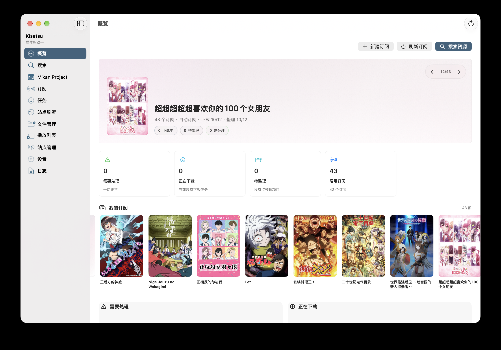
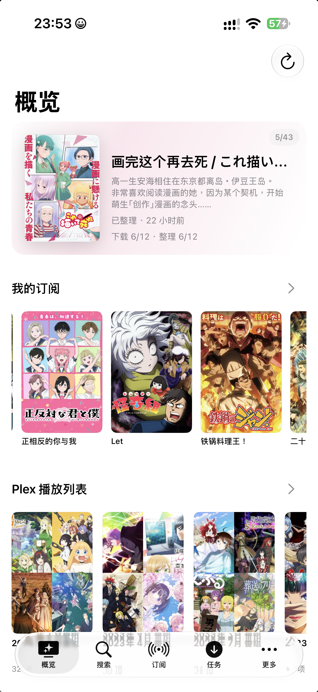
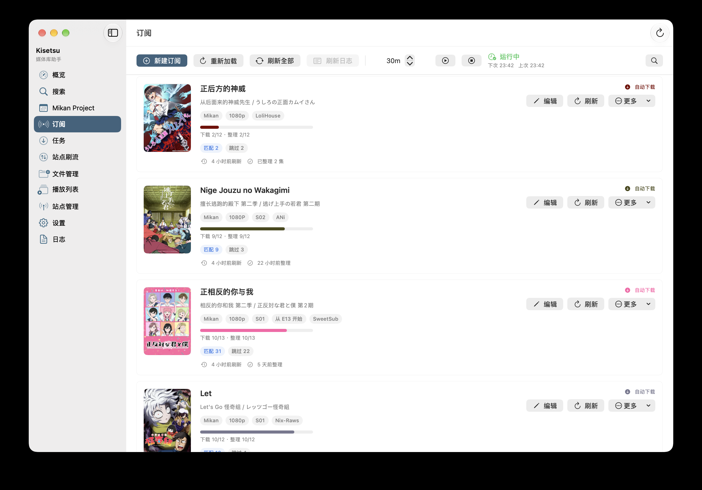
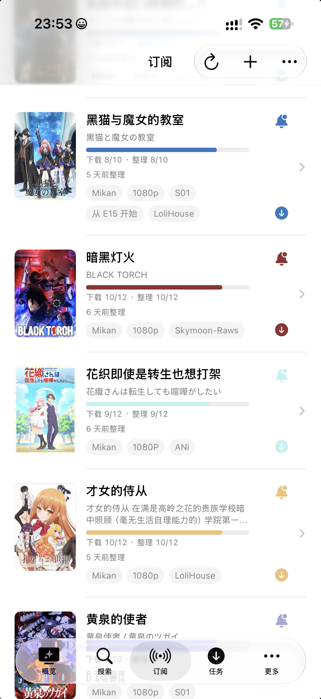

<p align="center">
  
</p>

<h1 align="center">Kisetsu</h1>

<p align="center">
  自托管的动画订阅、下载与媒体整理工具
</p>

<p align="center">
   macOS
  &nbsp;&nbsp;·&nbsp;&nbsp;
   iPhone
  &nbsp;&nbsp;·&nbsp;&nbsp;
   FastAPI
  &nbsp;&nbsp;·&nbsp;&nbsp;
   Plex
</p>

<p align="center">
  <a href="https://github.com/MIAONECYAN/Kisetsu/releases/latest"><strong>下载最新版本</strong></a>
  &nbsp;&nbsp;·&nbsp;&nbsp;
  <a href="#快速开始">快速开始</a>
  &nbsp;&nbsp;·&nbsp;&nbsp;
  <a href="NOTICE.md">使用说明</a>
</p>

> [!IMPORTANT]
> Kisetsu 是采用 [MIT License](LICENSE) 发布的开源软件。Kisetsu 不提供媒体内容、
> 站点账号或第三方服务；使用者应自行确保数据来源和使用行为合法，并在使用前阅读
> [NOTICE.md](NOTICE.md)。

Kisetsu 将资源搜索、订阅跟踪、下载任务、媒体识别、文件整理与 Plex 播放列表集中
到一套自托管工作流中。后端由使用者自行运行，macOS 与 iPhone 客户端连接同一服务，
配置和媒体数据保留在自己的环境内。

## 界面

<p align="center"><strong>概览</strong></p>
<p align="center">
  
  &nbsp;
  
</p>
<p align="center"><strong>订阅</strong></p>
<p align="center">
  
  &nbsp;
  
</p>

## 能力

| | |
| --- | --- |
| **订阅** | 关键词、Mikan 番组与 RSS；支持字幕组、分辨率、集数及正则筛选 |
| **搜索** | DMHY、Mikan、Nyaa 与已配置的 PT 站点 |
| **下载** | qBittorrent、Transmission，以及统一的任务与历史视图 |
| **整理** | Bangumi/TMDB 元数据识别，支持动画单集、多集、合集与电影 |
| **媒体库** | Plex 路径映射、媒体关联与播放列表浏览 |
| **客户端** | 原生 SwiftUI macOS 与 iPhone 客户端，共用自托管 FastAPI 后端 |

Kisetsu 不提供媒体内容、站点账号、Cookie、API Key、下载器或 Plex Server。

## 快速开始

### 运行后端

需要 Python 3.11 或更高版本：

```bash
git clone https://github.com/MIAONECYAN/Kisetsu.git
cd Kisetsu

python3 -m venv .venv
source .venv/bin/activate
python3 -m pip install -e ./backend
cp .env.example .env
set -a
source .env
set +a
./script/start_backend.sh
```

> [!NOTE]
> 自托管后端目前仅在 macOS 上完成运行与回归测试。Linux、Windows、NAS、容器及
> 其他平台需要使用者自行测试兼容性并承担相应风险。

### macOS 客户端

需要 macOS 15 或更高版本：

```bash
./script/build_and_run.sh
```

### iPhone 客户端

需要 Xcode 26 或更高版本。在仓库根目录运行：

```bash
./script/build_mobile_ipa.sh
```

输出为 `dist/Kisetsu.ipa`。该文件是 `arm64` 未签名包，安装前必须使用自己的开发者
证书签名。首次启动后，在客户端设置中填写设备可以访问的自托管后端地址。

## 配置与数据

`.env.example` 只包含本地配置模板。运行时凭证应写入未跟踪的 `.env`，或通过客户端
设置页保存。站点、通知、AI 与 Plex 认证资料存放于独立的
`kisetsu-secrets.sqlite3`；这是权限隔离存储，不是加密保险库。

不要提交或分享以下内容：

- `.env`、Token、Cookie、API Key 与签名材料。
- `data/`、SQLite 数据库及其 WAL/SHM 文件。
- 日志、备份、媒体路径和带有真实任务信息的截图。

## 发布包

[GitHub Releases](https://github.com/MIAONECYAN/Kisetsu/releases/latest) 提供：

- Python 3.11+ 后端源码包：解压后按包内 `README.md` 创建虚拟环境并启动。
- macOS Apple Silicon 客户端：ad-hoc 签名，未经 Apple 公证。
- iPhone `arm64` 客户端：未签名 IPA，需要使用者自行签名。
- `SHA256SUMS.txt`：发布附件的 SHA-256 校验值。

## 项目结构

```text
AppleClient/   macOS 与 iPhone SwiftUI 客户端
backend/       FastAPI 自托管后端
script/        启动、构建与打包脚本
```

## AI 编写声明

**本仓库中的代码由 AI 工具完整生成；需求定义、审核、测试和发布由项目维护者负责。**

公开源码不代表代码没有缺陷。使用者应自行审查其安全性、兼容性与适用性。

## 许可与免责声明

源码采用 [MIT License](LICENSE)，允许在保留版权与许可声明的前提下使用、复制、
修改、合并、发布、分发、再许可及销售软件副本。

软件按现状提供。维护者不对数据丢失、下载或整理结果、版权争议、账号封禁、服务中断
及其他使用后果承担责任。使用者应自行确认数据来源及使用行为符合所在地法律与第三方
服务条款。

完整使用说明与免责声明见 [NOTICE.md](NOTICE.md)；第三方项目与商标说明见
[THIRD_PARTY_NOTICES.md](THIRD_PARTY_NOTICES.md)。
